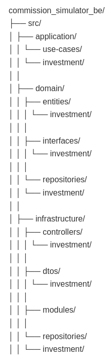

# Commission Simulator Application

A full-stack application designed for Commission Simulator, built with React + Vite and Node.js + Nestjs.

## 🚀 Tech Stack

### Package Manager

- Yarn

### Frontend

- React.js with Vite
- Tailwind CSS for styling
- React Router for navigation
- React Context for state management

### Backend

- Node.js
- Nestjs

#### Arquitecture

For this it was used hexagonal architecture, with the following layers:

#### Testing

It was used Jest for unit testing. To run the unit tests, it can be used the following command:

First of all, the packages need to be installed:

`yarn install`

Then, the tests can be run with the following command:

`yarn run test`

Or run the following command to see the coverage of the tests:

`yarn run test:cov`

## ⚙️ Prerequisites

- Docker and docker-compose installed.

## 🛠️ Installation

1. Clone the repository
2. In the commission_simulator_be folder, create a .env file with the correct values, there is a .env.example file that can be used as a reference. It was not included in the repository because it contains sensitive information.
3. Run `docker-compose up --build -d` create the containers and run the application. If there is a timeout error please try `docker compose up -d --force-recreate --build`
4. Go to `http://localhost:5173` to see the application.

## 📚 Documentation

It can be found the backend API documentation after running the application on this link:
http://localhost:3001/api/
